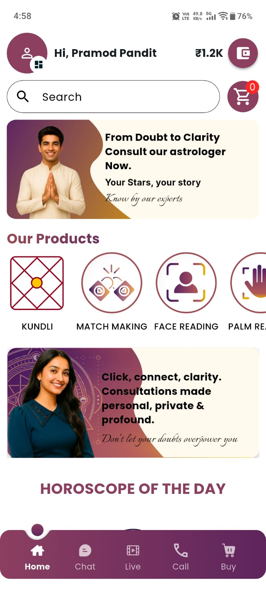
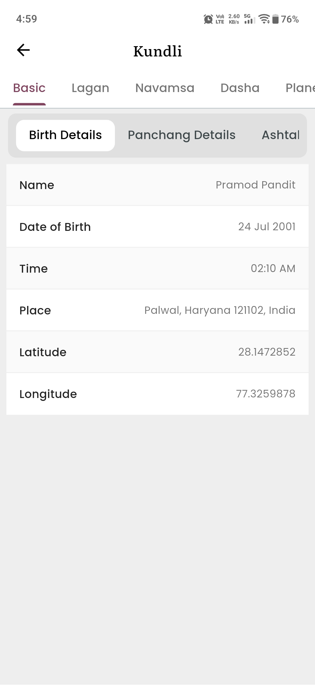
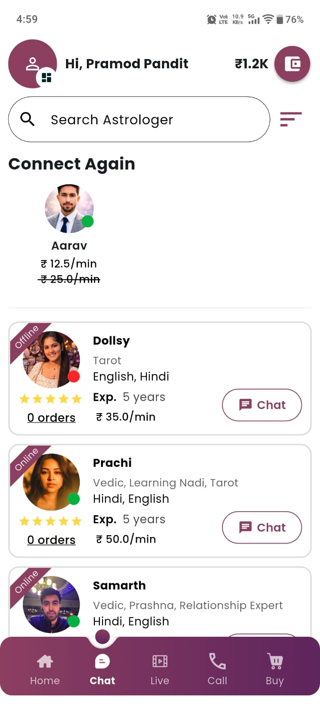

# 🔮 Zodify

> A feature-rich Vedic astrology platform offering daily horoscopes, Kundli insights, live consultations, and spiritual content — all in one seamless Flutter application.

---

## 📱 Overview

**Zodify** is a full-featured astrology app built for both **users** and **astrologers**. Users can explore personalized horoscopes, get Kundli readings, and connect with expert astrologers via real-time chat or voice/video calls. Astrologers get a dedicated dashboard to manage consultations and earnings.

> 🔒 This is a proprietary project — source code is not shared due to NDA. For any technical queries, feel free to reach out.

---

## ✨ Features

### 👤 For Users
- 📅 **Daily Horoscope** — Personalized daily predictions based on birth chart
- 🪐 **Kundli Generation** — Detailed Vedic birth chart with planetary positions
- 💬 **Real-time Chat** — Instant messaging with astrologers via Socket.IO
- 📞 **Voice & Video Calls** — Live consultation using Agora RTC Engine
- 💰 **Wallet System** — Recharge wallet and pay astrologers per-minute via Razorpay
- 🔔 **Push Notifications** — Alerts via Firebase Cloud Messaging
- 🎵 **Audio Player** — Stream spiritual & meditation audio with waveform display
- 🎶 **Music Player** — Healing & spiritual music streaming with background playback and media notification controls
- 📄 **PDF Viewer** — In-app document reading
- 💑 **Soulmate Sketch** — AI-generated personalized soulmate sketches
- 🛍️ **Astrology Products** — Browse and purchase astrology-related products with cart & checkout
- 🌿 **Remedies Booking** — Explore and book Vedic remedies with slot-based scheduling
- 🍎 **Sign in with Apple / Google** — Social authentication support

### 🔭 For Astrologers
- 📊 **Dashboard** — Manage availability, earnings, and consultation history
- 💬 **Chat & Call Management** — Accept/decline incoming user requests in real-time
- 💸 **Earnings Tracker** — Real-time wallet credit on session completion
- 📷 **Media Upload** — Share images and files during consultations

---

## 🛠️ Tech Stack

| Layer | Technology |
|---|---|
| **Framework** | Flutter |
| **Language** | Dart |
| **State Management** | BLoC |
| **Architecture** | MVVM |
| **Backend** | Node.js |
| **Real-time Chat** | Socket.IO |
| **Voice/Video Calls** | Agora RTC Engine |
| **Payments** | Razorpay |
| **Push Notifications** | Firebase Cloud Messaging |
| **Authentication** | Google Sign-In, Sign in with Apple |
| **Networking** | Dio |

---

## 🏗️ Project Structure

```
lib/
├── bloc/                          # BLoC state management
│   ├── astrologer_bloc/
│   ├── astrology_bloc/
│   ├── auth_bloc/
│   ├── buy_bloc/
│   ├── chat_bloc/
│   ├── dashboard_bloc/
│   ├── profile_bloc/
│   └── remedies_bloc/
│
├── data/
│   ├── api_services/              # Dio API service classes
│   ├── model/                     # Freezed data models (40+ models)
│   └── repository/                # Repository pattern layer
│
├── services/                      # App-wide services (FCM, Socket, Agora)
│
├── ui/
│   ├── auth/                      # Login, Register screens
│   ├── home_screens/              # User-side screens
│   │   ├── dashboard_screens/
│   │   ├── chat_ui/
│   │   ├── buy_screens/
│   │   ├── profile_screens/
│   │   └── remedies_screens/
│   ├── astrologer_home_screens/   # Astrologer-side screens
│   │   ├── astro_dash_screens/
│   │   ├── astro_booking_screens/
│   │   └── astro_profile_screens/
│   └── kundli/
│
└── widgets/                       # Reusable global widgets
```

---

## 🔄 Real-time Chat Flow

```
User sends message
      ↓
Socket.IO client emits event
      ↓
Node.js server receives & broadcasts
      ↓
Astrologer receives in real-time
      ↓
Per-minute billing triggers on session end
```

---

## 💳 Payment Flow

```
User recharges wallet (Razorpay)
      ↓
Wallet balance updated
      ↓
Session starts → per-minute deduction begins
      ↓
Session ends → astrologer earnings credited
```

---

## 📲 Deployment

[](https://play.google.com/store/apps/details?id=com.zodify.zodify&pcampaignid=web_share)
&nbsp;
[](https://apps.apple.com/in/app/zodify-relationship-astro/id6757225850)

---

## 📸 Screenshots

<p>
  
  
  
  
</p>

---

## 👨‍💻 Developer

**Pramod Sharma** — Flutter Developer | 3+ Years Experience

[](https://github.com/pramod52jpr)
[](mailto:pramod52jpr@gmail.com)